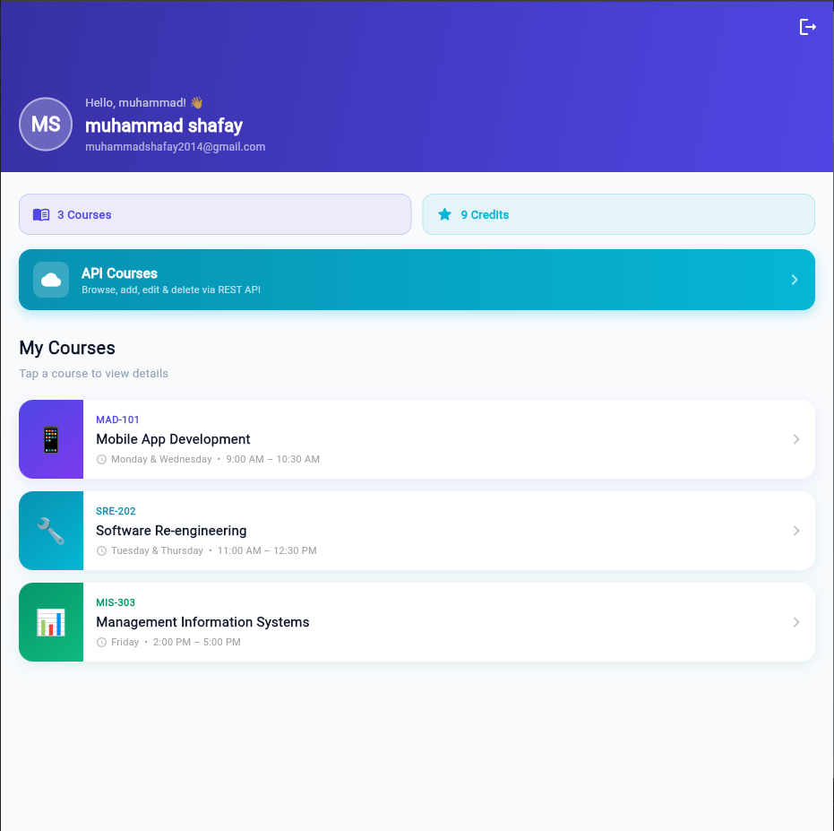
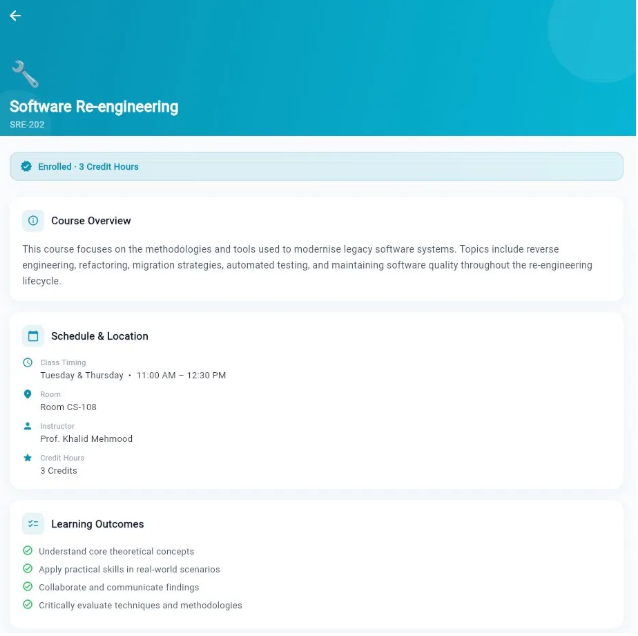

# EduAuth — Flutter Multi-Screen Authentication App

A complete multi-screen Flutter application built for the **Mobile App Development** assignment.  
It demonstrates user authentication, form validation, clean architecture, and navigation.

github url: https://github.com/SHAFAY04/myapp/

---

## Student Information

| Field | Value |
|-------|-------|
| **Student Name** | *Muhammad Shafay* |
| **Student ID** | *SE221098* |
| **Course** | Mobile App Development |
| **Framework** | Flutter / Dart |
| **API** | JSONPlaceholder (`https://jsonplaceholder.typicode.com`) |
| **API Docs** | https://jsonplaceholder.typicode.com/guide |

---

## Project Structure

```
lib/
├── main.dart                              # App entry, routing, MultiProvider
├── core/
│   ├── constants/app_constants.dart       # Colors, routes, subject data
│   ├── enums/
│   │   ├── gender_enum.dart
│   │   ├── auth_state_enum.dart
│   │   └── api_state_enum.dart            # loading / success / error
│   └── validators/app_validator.dart      # Reusable validator class
├── models/
│   ├── user_model.dart
│   ├── subject_model.dart
│   └── course_model.dart                  # Maps JSONPlaceholder /posts
├── services/
│   └── course_api_service.dart            # Pure HTTP layer (GET/POST/PUT/DELETE)
├── controllers/
│   ├── auth_controller.dart
│   └── course_controller.dart             # Business logic for CRUD
└── screens/
    ├── registration/registration_screen.dart
    ├── login/login_screen.dart
    ├── dashboard/dashboard_screen.dart
    ├── detail/detail_screen.dart
    └── courses/
        ├── courses_screen.dart            # List + delete
        └── course_form_screen.dart        # Add + edit (shared form)
```

---

## API Integration

### Endpoint Used

| Operation | Method | Endpoint |
|-----------|--------|----------|
| Fetch all courses | `GET` | `/posts?_limit=20` |
| Fetch single course | `GET` | `/posts/:id` |
| Create course | `POST` | `/posts` |
| Update course | `PUT` | `/posts/:id` |
| Delete course | `DELETE` | `/posts/:id` |

All calls target `https://jsonplaceholder.typicode.com`.  
Documentation followed: https://jsonplaceholder.typicode.com/guide

### Architecture
- **`CourseApiService`** — pure Dart HTTP layer, zero Flutter imports. Handles all network calls, JSON encoding/decoding, and error throwing.
- **`CourseController`** — ChangeNotifier controller that calls the service, manages `ApiState` (loading / success / error), and exposes the course list to the UI.
- **`CoursesScreen` / `CourseFormScreen`** — UI only reads state and calls controller methods. No HTTP logic anywhere in the UI layer.

### State Handling
Every API operation goes through three states managed by `ApiState` enum:
- `loading` → shows `CircularProgressIndicator`
- `success` → updates the list / pops the form
- `error` → shows user-friendly error message + retry option

---

## Features

### Authentication (existing)
- Registration with real-time validation, password rules checklist
- Login with show/hide toggle and Remember Me (session persistence)
- Dashboard with user info, subject list, logout
- Detail screen per subject

### CRUD — API Courses (new)
- **Read**: Fetches courses from `/posts`, shows loading indicator and error/retry state
- **Create**: Form with title + description, POST to API, inserted at top of list
- **Update**: Pre-filled edit form, PUT to API, reflected immediately in list
- **Delete**: Confirmation dialog, DELETE to API, removed from list on success
- Pull-to-refresh on the list screen
- HTTP method badge shown on the form (POST / PUT)

---

## Screens

> 

| Splash | Registration | Login |
|--------|-------------|-------|
|  |  |  |

| Dashboard | Detail |
|-----------|--------|
|  |  |

---
```
